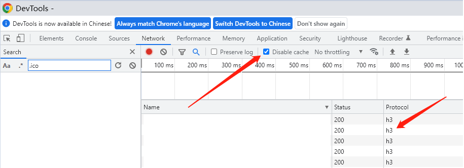
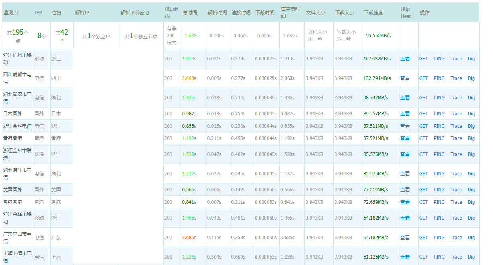

- OAMlab
- https://github.com/oamlab

# 关于《性能测试》

- ----------------------------

## 网站访问速度对比测试：

### 1、查看网站的HTTP/3是否已经可用：

	

### 2、在搜索引擎搜索“网站测速”、“网站速度测试”、“website speed test”找到相关测试网站，测试过程如下图：

	

